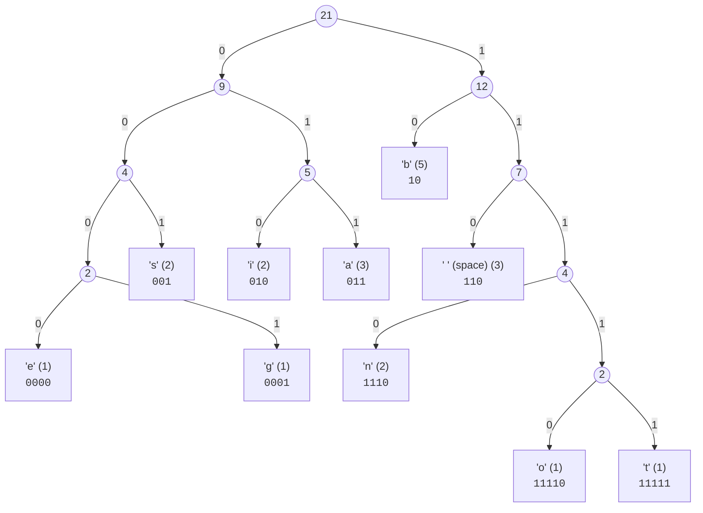

## 📌 In This Document:

* [Project Setup](#-project-setup)
* [Under the Hood](#-under-the-hood)
* [References](#-references)

---

## 📌 Project Setup

Follow these steps sequentially to build and run the project locally.

### 1. Clone the Repository

Clone the repository and navigate into the project directory:

```bash
git clone https://github.com/Can-Vural/Smasher.git
cd Smasher
```

### 2. Prepare the Input File

Edit your input file at:

```text
data/input.txt
```

### 3. Compile the Source Code

Compile all C source files into an executable using `gcc`:

```bash
gcc -Wall -Wextra -O2 main.c huffman.c compress.c bit_io.c -o smasher
```

### 4. Execute the Application

Run the compiled binary from the project root directory:

```bash
./smasher
```

---

## 📌 Under the Hood

This project implements lossless data compression using Huffman Coding through the following pipeline:

1. **Frequency Analysis:** Reads the source text (`input.txt`) and counts the occurrence frequency of each ASCII byte (0–255).
2. **Min-Heap Construction:** Initializes leaf nodes for every character with a non-zero frequency and structures them into a min-heap.
3. **Huffman Tree Assembly:** Repeatedly extracts the two lowest-frequency nodes, creates an internal parent node whose frequency is the sum of both, and reinserts it into the heap until a single root remains.
4. **Prefix Code Mapping:** Traverses the tree (left branch = `0`, right branch = `1`) to generate unique, variable-length binary prefix codes for each character.
5. **Serialization & Bit-Level Writing:**
   * Writes the total character count as metadata.
   * Serializes the tree structure using pre-order traversal (`1` for leaf + 8-bit character byte, `0` for internal node).
   * Encodes the text using the prefix codes via a custom 8-bit software buffer.
   * Flushes any remaining leftover bits with byte-alignment padding.
6. **Decompression:** Reconstructs the exact Huffman tree from the header stream and traverses it bit-by-bit to restore the original characters until the recorded character count is reached.

---


## Let's break down the sentence:

```text
big bob bites bananas
```

First, we need to determine the frequency of each character.

## Character Frequencies

```text
(data: 'e') -> (Freq: 1)
(data: 'g') -> (Freq: 1)
(data: 's') -> (Freq: 2)
(data: 'i') -> (Freq: 2)
(data: 'a') -> (Freq: 3)
(data: 'b') -> (Freq: 5)
(data: ' ') -> (Freq: 3)
(data: 'n') -> (Freq: 2)
(data: 'o') -> (Freq: 1)
(data: 't') -> (Freq: 1)
```

The total number of characters is:

```text
21
```

## Generated Huffman Codes

After constructing the Huffman tree, we can generate the corresponding Huffman codes:

```text
(data: 'e') -> (Freq: 1) -> (Code: 0000)
(data: 'g') -> (Freq: 1) -> (Code: 0001)
(data: 's') -> (Freq: 2) -> (Code: 001)
(data: 'i') -> (Freq: 2) -> (Code: 010)
(data: 'a') -> (Freq: 3) -> (Code: 011)
(data: 'b') -> (Freq: 5) -> (Code: 10)
(data: ' ') -> (Freq: 3) -> (Code: 110)
(data: 'n') -> (Freq: 2) -> (Code: 1110)
(data: 'o') -> (Freq: 1) -> (Code: 11110)
(data: 't') -> (Freq: 1) -> (Code: 11111)
```

## Huffman Tree

The resulting Huffman tree looks like this:



---

## Compressed File Structure

If we inspect the compressed binary file from the terminal using `xxd -b`, we get:

```Bash
~/CLionProjects/Smasher/data
❯ xxd -b  compressed.smsh
00000000: 00010101 00000000 00000000 00000000 00001011 00101101  .....-
00000006: 10011110 11100110 10110100 11011000 01010110 00100100  ....V$
0000000c: 10000001 01101110 01011011 11101110 10010010 00011101  .n[...
00000012: 01111010 11010010 11111000 00011101 00111110 01111100  z...>|
00000018: 11001000     
```

### Character Count

The first 4 bytes represent the total character count stored in the file.`00010101`, which equals 21 in decimal.

```text
00010101 00000000 00000000 00000000
```

### Huffman Tree Header

The next ~12 bytes represent our Huffman tree required to decode the message.

The tree is serialized using a pre-order traversal:

```text
0 -> Internal node
1 -> Leaf node + 8-bit character
```

```Bash
0-0-0-0-1-01100101(e)-1-01100111(g)-1-01110011(s)-0-1-01101001(i)-
1-01100001(a)-0-1-01100010(b)-0-1-00100000('')-
0-1-01101110(n)-0-1-01101111(o)-1-01110100(t)
```

### Encoded Message

The subsequent ~2 bytes contain the encoded content of our message.

```Bash
10(b) 010(i) 0001(g) 110( ) 10(b) 11110(o) 10(b) 110( )
10(b) 010(i) 11111(t) 0000(e) 001(s) 110( ) 10(b) 011(a)
1110(n) 011(a) 1110(n) 011(a) 001(s) (000000 padding)
```

---

## 📌 References

Useful videos that I watched to better understand Huffman coding:

* **Video 1:**
  https://youtu.be/co4_ahEDCho

* **Video 2:**
  https://youtu.be/yue6yqhmfSg
